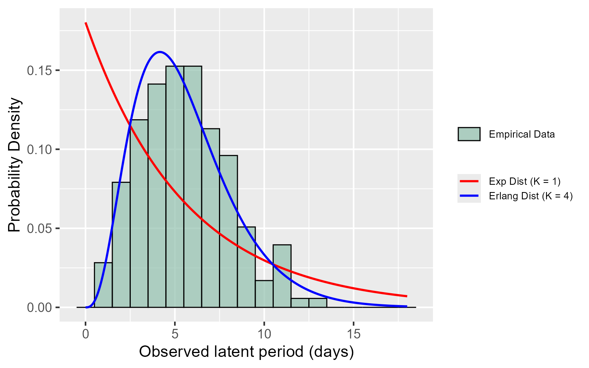
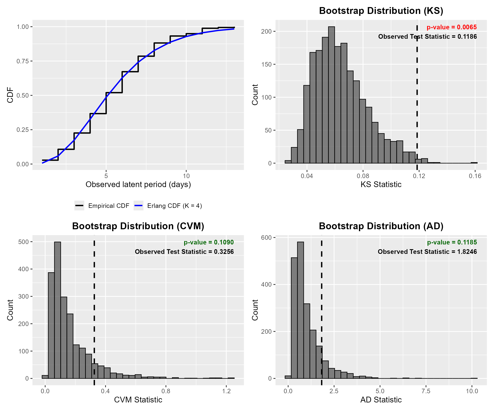
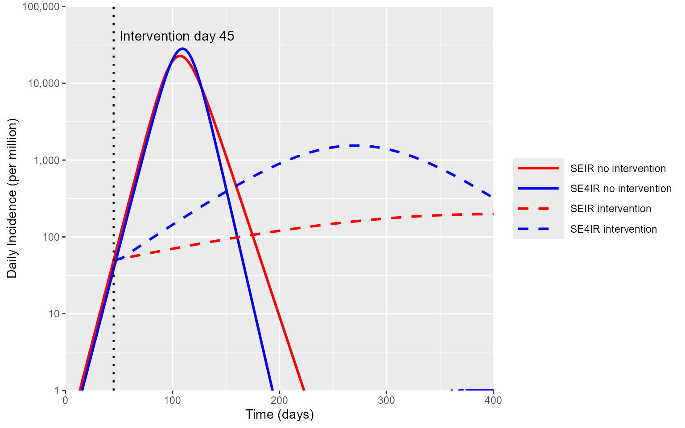
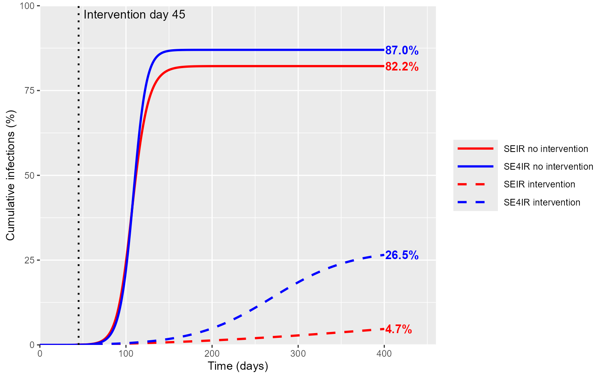

# An Application of GenErlangFit to Epidemic Modeling

## 1. Introduction and Overview

Estimating waiting time distributions and building parsimonious yet
realistic compartmental models are common tasks in outbreak analytics.
This vignette provides a practical example of how **GenErlangFit** can
be used to support that workflow: first by estimating a suitable latent
period distribution from data, and then by using that fitted
distribution to parameterize and simulate epidemic models more
realistically.

Here we consider latent period data from Xin et al, who estimated the
duration of the latent period for COVID-19, defined as the time between
exposure and the onset of detectable viral shedding, using it as a proxy
for infectiousness. In their cohort of 177 closely monitored contacts of
confirmed cases, they inferred a mean latent period of 5.5 days and a
95th percentile of 10.6 days.

*Note:* the original data consist of interval-censored windows rather
than exact event times. For demonstration purposes, we therefore sampled
exact latent periods for each participant.

In the sections below, we show how to:

- Fit an Erlang distribution to the latent period data using
  **GenErlangFit**
- Assess goodness-of-fit using KS, CVM, and AD statistics
- Use the fitted parameters to parameterize an ODE SEIR-style simulation
- Compare epidemic trajectories assuming an exponentially and erlang
  distributed waiting time assumptions

Reference: Xin H, Li Y, Wu P, Li Z, Lau EHY, Qin Y, et al. Estimating
the Latent Period of Coronavirus Disease 2019 (COVID-19). *Clin Infect
Dis.* 2022;74:1678–81. <https://doi.org/10.1093/cid/ciab746>.

## 2. Install Libraries

``` r
library(deSolve)
library(ggplot2)
library(patchwork)
library(tidyverse)
library(GenErlangFit)
```

## 3. Loading latent period data

Before fitting, the input data must be provided as a single numeric
vector of strictly positive observed time-to-event values. In this
tutorial, we use the sampled latent period data directly, although the
same workflow can also be applied to data imported from a CSV file.

``` r
latent_time_data <- c(4, 3, 11, 4, 4, 7, 5, 5, 11, 6, 4, 11, 4, 4, 5, 5, 5, 10, 1, 5,
                     10, 4, 8, 9, 6, 8, 2, 2, 12, 5, 7, 6, 3, 4, 8, 5, 4, 3, 3, 4,
                     2, 4, 7, 9, 4, 4, 6, 5, 4, 5, 7, 3, 3, 4, 7, 3, 6, 4, 6, 8,
                     7, 8, 6, 4, 2, 7, 7, 5, 7, 3, 4, 9, 5, 5, 2, 5, 3, 8, 6, 5,
                     3, 4, 3, 11, 3, 8, 13, 7, 4, 11, 3, 9, 5, 7, 5, 8, 7, 5, 2, 1,
                     6, 2, 6, 3, 6, 3, 9, 3, 2, 6, 2, 9, 5, 3, 6, 5, 6, 5, 5, 7,
                     5, 9, 6, 2, 7, 8, 2, 6, 6, 6, 6, 4, 9, 9, 8, 8, 6, 3, 6, 11,
                     3, 6, 6, 2, 7, 1, 11, 3, 8, 6, 5, 8, 8, 2, 6, 7, 5, 7, 4, 5,
                     5, 8, 1, 10, 4, 6, 7, 7, 8, 4, 1, 6, 8, 2, 7, 3, 4)

data_latent <- latent_time_data
Mu <- mean(data_latent)
OG_sigma <- 1 / Mu
```

## 4. Fit latent period data with GenErlangFit

We next fit the latent period observations using **GenErlangFit**. This
step identifies the Erlang distribution parameters that best match the
observed waiting time data. The best-fitting model parameters are then
extracted from FitR\$Best.

``` r
FitR <- GenErlang_Fit("erlang", data_latent, pvaloption = "NIL", ShowFigures = FALSE)


K_star <- FitR$Best$K_star
Lambda_star <- FitR$Best$Lambda_star

print(FitR$ResultsTable)
```

    ##    Model K ErlangLambda LogLikelihood
    ## 1 Erlang 4    0.7209776      -410.608



*Fig 1. Histogram of the observed latent period data with overlaid
Exponential PDF and Erlang PDF fitted using **GenErlangFit**.*

  

## 5. Evaluate fit with GenErlangFit

The adequacy of the fitted Erlang model is assessed using parametric
bootstrap hypothesis testing based on KS, CVM, and AD test statistics
with a default significance level of $`\alpha = 0.05`$.

``` r
FitR_KS <- GenErlang_Fit("erlang", data_latent, pvaloption = "KS", ShowFigures = FALSE)
FitR_CVM <- GenErlang_Fit("erlang", data_latent, pvaloption = "CVM", ShowFigures = FALSE)
FitR_AD <- GenErlang_Fit("erlang", data_latent, pvaloption = "AD", ShowFigures = FALSE)
```



*Fig 2. Goodness-of-fit assessment for the fitted Erlang latent period
model. The upper-left panel compares the empirical data CDF and fitted
Erlang CDFs. The remaining panels show bootstrap distributions for the
KS, CVM, and AD test statistics, with the observed statistic marked by a
dashed line.*

  

While the KS test rejects this fit, the CVM and AD tests do not. Since
KS is driven by the single largest discrepancy between empirical and
fitted CDFs, it can be sensitive to localized departures or tied
observations. CVM and AD assess agreement more broadly across the
distribution, with AD giving additional emphasis to the tails. For this
reason, we proceed with the $`K = 4`$ Erlang model as a parsimonious and
defensible choice for the downstream simulations.

## 6. Simulating SEIR and SE4IR trajectories

In the following sections, we show how latent period information
estimated with **GenErlangFit** can be carried forward into epidemic
simulation. We first define a flexible SEIR-style compartmental
framework with Erlang staging, then specialize it to two models: the
standard SEIR model ($`K = 1`$) and the SE$`_4`$IR model ($`K = 4`$),
with the latter parameterized using the fitted latent period
distribution.

*Note:* Both models are calibrated to have the same mean latent period
and early exponential growth rate, reflecting standard practice in which
$`R_0`$ is inferred from early incidence data. We then simulate epidemic
trajectories with and without a 50% transmission-reducing intervention.

### 6.1 Setting up simulation ODE system

``` r
SEIR_ERLANG_ODE <- function(t, y, p) {
  
  kE <- p$Esubstates   # Number of Erlang E substates
  kI <- p$Isubstates   # Number of Erlang I substates
  
  dydt <- numeric(kE + kI + 1)
  
  # E1
  dydt[1] <- (1 - p$eps) * (p$beta / p$N) * sum(y[(kE + 1):(kE + kI)]) * (p$N - sum(y)) - p$sigma * y[1]
  
  # E2 to EkE
  if (kE > 1) {
    Ecount <- 1
    while (Ecount < kE) {
      dydt[Ecount + 1] <- p$sigma * y[Ecount] - p$sigma * y[Ecount + 1]
      Ecount <- Ecount + 1
    }
  }
  
  # I1
  dydt[kE + 1] <- p$sigma * y[kE] - p$gamma * y[kE + 1]
  
  # I2 to IkI
  if (kI > 1) {
    Icount <- 1
    while (Icount < kI) {
      dydt[Icount + 1 + kE] <- p$gamma * y[Icount + kE] - p$gamma * y[Icount + 1 + kE]
      Icount <- Icount + 1
    }
  }
  
  # Final recovered / removed compartment
  dydt[kI + kE + 1] <- p$gamma * y[kI + kE]
  
  list(dydt)
}
```

We now simulate two epidemic models:

- **SEIR**, which assumes an exponential latent period
- **SE$`_4`$IR**, which uses the fitted Erlang latent period structure

We generate trajectories under two scenarios:

- **No intervention**
- **With intervention**

### 6.2 Setting up simulation parameters

``` r
# 1. Defining Population Parameters
N <- 1e6
T <- 400
tspan <- 0:T

# 2. Define SEIR - Exponential Waiting Time Assumption Params
Ro_1 <- 2.1
gamma <- 0.5
sigma <- OG_sigma
beta_1 <- Ro_1 * gamma

# 3. Solve for SEIR - Exponential Waiting Time Assumption early exp growth rate
r_eq <- c(1 / (gamma * sigma),
          1 / gamma + 1 / sigma,
          1 - Ro_1)

# R polyroot expects coefficients in increasing powers:
# a0 + a1*x + a2*x^2
x <- polyroot(rev(r_eq))
r_1 <- max(Re(x[abs(Im(x)) < 1e-8]))

# 4. Using the prior K_star solve for SE4IR - Erlang Waiting Time Assumption
# by equating the early exponential growth rate to what was calculated above
nE <- K_star   # Obtained from GenErlangFit as number of substates for E
nI <- 1

Ro_n <- (r_1 / gamma) * ((1 + r_1 / (sigma * nE))^nE) / (1 - (1 + r_1 / (gamma * nI))^(-nI))
beta_n <- Ro_n * gamma
```

### 6.3 Running SEIR and SE4IR simulations without interventions

``` r
# Simulate K = 1 SEIR
p1 <- list(
  N = N,
  beta = beta_1,
  sigma = sigma,
  gamma = gamma,
  Esubstates = 1,
  Isubstates = 1,
  eps = 0
)

y0_1 <- c(E1 = 0, I1 = 1, R = 0)

SE1IR_noint <- ode(
  y = y0_1,
  times = tspan,
  func = SEIR_ERLANG_ODE,
  parms = p1
)

SE1IR_noint <- as.data.frame(SE1IR_noint)

SE1IR_noint$S <- N - rowSums(SE1IR_noint[, c("E1", "I1", "R")])


# Simulate K = nE SE4IR
p4 <- list(
  N = N,
  beta = beta_n,
  sigma = sigma * nE,
  gamma = gamma,
  Esubstates = nE,
  Isubstates = nI,
  eps = 0
)

y0_n <- c(rep(0, nE), 1, 0)
names(y0_n) <- c(paste0("E", 1:nE), "I1", "R")

SE4IR_noint <- ode(
  y = y0_n,
  times = tspan,
  func = SEIR_ERLANG_ODE,
  parms = p4
)

SE4IR_noint <- as.data.frame(SE4IR_noint)

SE4IR_noint$S <- N - rowSums(SE4IR_noint[, c(paste0("E", 1:nE), "I1", "R")])
```

### 6.4 Running SEIR and SE4IR simulations with 50% reduction in Beta intervention

``` r
# 1. Set up intervention params
intervention_day <- 45
beta_reduction <- 0.5  # 50% reduction

# Time spans
tspan_before <- 0:intervention_day
tspan_after <- intervention_day:T


# 2. Run for E = 1
# Before intervention
SE1IR_before <- ode(
  y = y0_1,
  times = tspan_before,
  func = SEIR_ERLANG_ODE,
  parms = p1
)

SE1IR_before <- as.data.frame(SE1IR_before)

# After intervention
p1_after <- p1
p1_after$beta <- beta_1 * beta_reduction

y0_1_after <- SE1IR_before[nrow(SE1IR_before), -1]
y0_1_after <- as.numeric(y0_1_after)
names(y0_1_after) <- names(y0_1)

SE1IR_after <- ode(
  y = y0_1_after,
  times = tspan_after,
  func = SEIR_ERLANG_ODE,
  parms = p1_after
)

SE1IR_after <- as.data.frame(SE1IR_after)

# Combine
SE1IR_int <- bind_rows(
  SE1IR_before,
  SE1IR_after[-1, ]
)

# Add S
SE1IR_int$S <- N - rowSums(SE1IR_int[, c("E1", "I1", "R")])


# 3. Run for E = 4
# Before intervention
SE4IR_before <- ode(
  y = y0_n,
  times = tspan_before,
  func = SEIR_ERLANG_ODE,
  parms = p4
)

SE4IR_before <- as.data.frame(SE4IR_before)

# After intervention
p4_after <- p4
p4_after$beta <- beta_n * beta_reduction

y0_4_after <- SE4IR_before[nrow(SE4IR_before), -1]
y0_4_after <- as.numeric(y0_4_after)
names(y0_4_after) <- names(y0_n)

SE4IR_after <- ode(
  y = y0_4_after,
  times = tspan_after,
  func = SEIR_ERLANG_ODE,
  parms = p4_after
)

SE4IR_after <- as.data.frame(SE4IR_after)

# Combine
SE4IR_int <- bind_rows(
  SE4IR_before,
  SE4IR_after[-1, ]
)

# Add S
SE4IR_int$S <- N - rowSums(SE4IR_int[, c(paste0("E", 1:nE), "I1", "R")])
```

From the simulated trajectories, we compute two summary outputs for
plotting:

- Daily incidence, computed as the day-to-day difference in the
  cumulative number infected: $`c(0, \mathrm{diff}(I + R))`$
- Cumulative infections: $`(I + R)/N \times 100`$

``` r
# 1. Create Cumulative Infection Data Frames
SE1IR_noint_cuminf <- SE1IR_noint %>%
  transmute(time = time, cum_inf = (I1 + R) / N * 100)

SE4IR_noint_cuminf <- SE4IR_noint %>%
  transmute(time = time, cum_inf = (I1 + R) / N * 100)

SE1IR_int_cuminf <- SE1IR_int %>%
  transmute(time = time, cum_inf = (I1 + R) / N * 100)

SE4IR_int_cuminf <- SE4IR_int %>%
  transmute(time = time, cum_inf = (I1 + R) / N * 100)


# 2. Create Daily Incidence Data Frames
SE1IR_noint_Inc <- SE1IR_noint %>%
  transmute(time = time, inc = c(0, diff(I1 + R)))

SE4IR_noint_Inc <- SE4IR_noint %>%
  transmute(time = time, inc = c(0, diff(I1 + R)))

SE1IR_int_Inc <- SE1IR_int %>%
  transmute(time = time, inc = c(0, diff(I1 + R)))

SE4IR_int_Inc <- SE4IR_int %>%
  transmute(time = time, inc = c(0, diff(I1 + R)))
```

### 6.5 Comparing epidemic trajectories

Finally, we compare the simulated epidemic trajectories under the SEIR
and SE4IR models, with and without intervention.

#### Comparing Daily Incidence Trajectories



*Fig 3. Simulated daily incidence trajectories under the SEIR and
SE$`_4`$IR models, with and without intervention.*

  

#### Comparing Cumulative Infection Trajectories



*Fig 4. Simulated cumulative incidence trajectories under the SEIR and
SE$`_4`$IR models, with and without intervention.*

  

The resulting daily incidence and cumulative infection curves highlight
how differences assumptions on the latent period distribution can affect
epidemic dynamics. Without intervention, the exponential model projected
82% cumulative infections compared to 87% under the Erlang model. With
intervention, the gap widened substantially. The exponential model
predicted 5% cumulative infections while the Erlang model predicted 27%.

This discrepancy arises because models assuming exponential latent
periods underestimate the basic reproduction number (R₀) compared to
more realistic models incorporating a lower-variance latent period
distribution, when calibrated to reproduce the same observed early
growth rate. This is an important contrast to the finding that final
epidemic size does not depend on the details of the generation interval
distribution (e.g., the number of substates describing the latent or
infectious states), conditional on $`R_0`$ being kept constant
